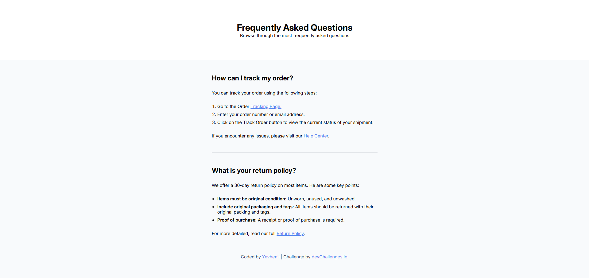

<!-- Будь ласка, оновіть значення у {}  -->

<h1 align="center">Simple Frequently Asked Questions(FAQ) | devChallenges</h1>

   Рішення для челенджу <a href="https://devchallenges.io/challenge/simple-faq-challenge" target="_blank">Проста сторінка FAQ</a> від <a href="http://devchallenges.io" target="_blank">devChallenges.io</a>.

  <h3>
    <a href="{https://your-demo-link.your-domain}">
      Демонстрація
    </a>
     | 
    <a href="{https://your-url-to-the-solution}">
      Рішення
    </a>
     | 
    <a href="https://devchallenges.io/challenge/simple-faq-challenge">
      Челендж
    </a>
  </h3>

<!-- ЗМІСТ -->

## Зміст

- [Огляд](#огляд)
  <!-- - [Що я дізнався](#що-я-дізнався) -->
  <!-- - [Корисні ресурси](#корисні-ресурси) -->
- [Розроблено за допомогою](#розроблено-за-допомогою)
- [Функціонал](#функціонал)
<!-- - [Контакти](#контакти) -->
- [Подяки](#подяки)
- [Автор](#автор)

<!-- ОГЛЯД -->

## Огляд

<!--
Розкажіть про свій проєкт, використовуючи скріншоти або GIF-анімацію. Спробуйте відповісти на запитання:

- Чого ви навчилися або що вдосконалили?
- Які висновки зробили?
-->

<!-- ### Що я дізнався -->

<!-- Використовуйте цей розділ, щоб узагальнити основні висновки та знання, отримані під час роботи над проєктом. Можете додати приклади коду. -->

<!-- ### Корисні ресурси -->

<!--
- [Приклад ресурсу 1](https://www.example.com) - Допоміг мені розібратися в XYZ. Дуже сподобався цей підхід, буду використовувати його надалі.
- [Приклад ресурсу 2](https://www.example.com) - Чудова стаття, яка допомогла мені зрозуміти XYZ. Рекомендую всім, хто ще вивчає цю тему.
-->

### Розроблено за допомогою

<!-- У цьому розділі зазначте основні технології та інструменти, використані для розробки проєкту. -->

- Семантична розмітка HTML5
- Власні CSS-змінні

## Функціонал

<!-- Перерахуйте функції вашого застосунку або сайту. -->

Цей застосунок/сайт було створено в рамках [DevChallenges](https://devchallenges.io/challenges-dashboard).

## Подяки

<!-- У цьому розділі ви можете вказати корисні статті або плагіни, які допомогли вам у процесі розробки. Це необов'язково, але може бути корисним у майбутньому. -->

- Центрування в CSS: як вирівняти div, текст та багато іншого [freecodecamp](https://www.freecodecamp.org/ukrainian/news/tsentruvannya-v-css-yak-vyrivnyaty-div-tekst-ta-bahato-inshoho/)

## Автор

- Вебсайт [your-website.com](https://{your-web-site-link})
- GitHub [@uncle-Yevhenii](https://{github.com/uncle-Yevhenii})
